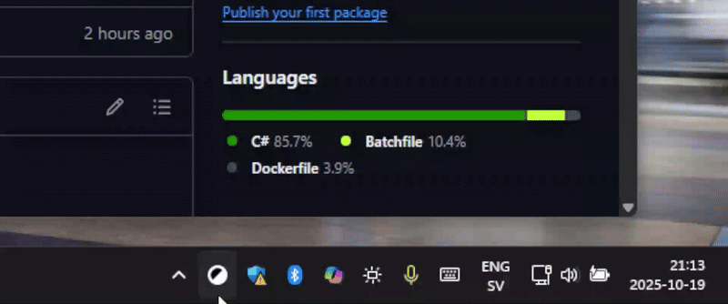

# Toggle Theme in Windows

A simple Windows taskbar application to toggle between Light Mode and Dark Mode with a single click.

> [Download ToggleTheme.exe](https://github.com/thor-computer/toggle-theme-windows/releases/latest/download/ToggleTheme.exe)



## Features

- **One-click toggle**: Left-click the taskbar icon to instantly switch between Light and Dark mode
- **System tray integration**: Runs quietly in the Windows taskbar
- **Auto-start**: Automatically starts with Windows
- **Lightweight**: Minimal resource usage
- **Visual feedback**: Shows a notification when the theme is changed

## Usage

1. Run the program - it will appear in your system tray
2. **Left-click** the icon to toggle between Light and Dark mode
3. **Right-click** for additional options:
   - Toggle Theme
   - Exit

The program will automatically start with Windows after the first run.

## How to Build

### Prerequisites

- **Visual Studio 2022 Build Tools** with the Managed Desktop workload
- **.NET Framework 4.7.2 Targeting Pack** (installed as a component of Build Tools)

### Install Prerequisites

Install the required build tools:

```bat
install.bat
```

### Build

Build the program:

```bat
build.bat
```

Program is built to `ToggleTheme/bin/Release/ToggleTheme.exe`.

### Run

Run the program after building:

```bat
run.bat
```

## Troubleshooting

**Program doesn't appear in taskbar on Windows 11**

If you are using Windows 11, you may need to add the program to your taskbar:

1. Run the program
2. Right-click your taskbar and select "Taskbar settings"
3. In the Settings select "Other system tray icons"
4. Enable the system tray icon for "ToggleTheme"

## How It Works

The program modifies the Windows registry keys that control the system theme:
- `HKEY_CURRENT_USER\Software\Microsoft\Windows\CurrentVersion\Themes\Personalize\AppsUseLightTheme`
- `HKEY_CURRENT_USER\Software\Microsoft\Windows\CurrentVersion\Themes\Personalize\SystemUsesLightTheme`

It then broadcasts a `WM_SETTINGCHANGE` message to notify all applications of the theme change.

## License

This project is open source and available for personal and commercial use.
